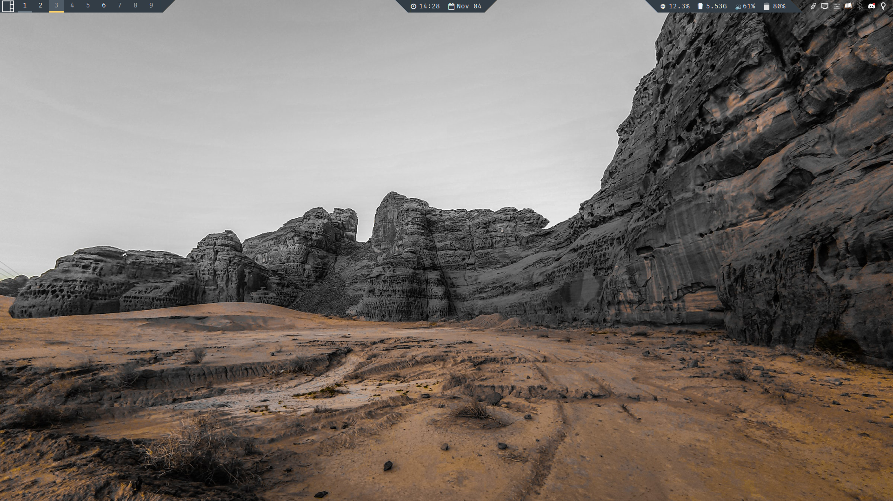

# My Qtile configs

## 1. Presiquities:
- **python 3.11**: of course
- python311-dbus_next
- **[Font Awesome 5](https://fontawesome.com/v5/search)**r
- playerctl
- **feh**: to set wallpaper
- **brightnessctl**: to mofify backlight brightness
- **pavu**: to modify sound profile
- **xfce4-goodies**: for notifications, power manager, task manager and screenshots
- **[autorandr](https://github.com/phillipberndt/autorandr)**: Auto config monitors for X11
- rofi and [rofi themes](https://github.com/adi1090x/rofi)
- picom

## 2. Recommended packages:
- **nm-applet**: to monitor network
- **blueman-applet**: to monitor bluetooth
- **Papirus-folders**
- **lxappearance**: to change gtk theme

## 3. For your setup:

There are a few constants that I'm too lazy to refactor, so you will have to change them yourselves:
- **Wallpaper**: Insert your path to your wallpaper into **```autorestart.sh```**, the ```feh``` line.
- **Audio sink name**: use

    ```pacmd list-sinks | grep -e 'name:' -e 'index:'``` 

    to find your audio sink's name, then assign it to the ```sink_name``` variable in **```modules/keys```**. Or else, you won't be able to change your volume with keyboards if when connect your laptop with an HDMI cable.
- **Keyboard shortcuts**: some shortcuts are moved from ```modules/keys.py``` to ```xfce4-keyboard-shortcuts.xml```. Either uncomment shortcuts in keys.py, or put the .xml file to ```~/.config/xfce4/xfconf/xfce-perchannel-xml/```.

## 4. Notes
- Quit command (to put into rofi): `qtile cmd-obj -o cmd -f shutdown`
- Config for bar and color schemes are in `modules/screens.py`

## 5. Example
- A screenshot with *simple_slash_top* bar style, with a minimal wallpaper:
    
- With *cockpit* bar with Saudi Rocks wallpaper:
    
