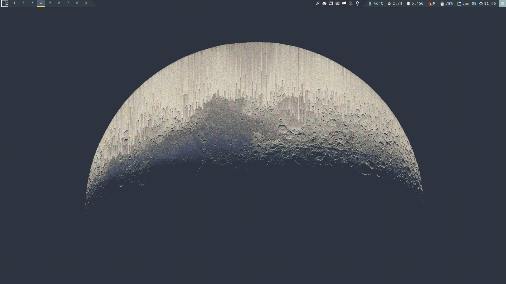

# My Qtile configs

## 1. Presiquities:
- **python 3**: of course
- **Font Awesome 5**
- **feh**: to set wallpaper
- **brightnessctl**: to mofify backlight brightness
- **pavu**: to modify sound profile
- **xfce4-goodies**: for notifications, power manager, task manager and screenshots
- **[autorandr](https://github.com/phillipberndt/autorandr)**: Auto config monitors for X11

## 2. Recommended packages:
- **nm-applet**: to monitor network
- **blueman-applet**: to monitor bluetooth
- **Papirus-folders**
- **lxappearance**: to change gtk theme

## 3. For your setup:

There are a few constants that I'm too lazy to refactor, so you will have to change them yourselves:
- Wallpaper: Insert your path to your wallpaper into **```autorestart.sh```**, the ```feh``` line.
- Audio sink name: use

    ```pacmd list-sinks | grep -e 'name:' -e 'index:'``` 

    to find your audio sink's name, then assign it to the ```sink_name``` variable in **```modules/keys```**. Or else, you won't be able to change your volume with keyboards if when connect your laptop with an HDMI cable.

## 4. Notes
- Quit command (to put into rofi): `qtile cmd-obj -o cmd -f shutdown`

## 5. Example
- A screenshot with *simple_slash_translucent* bar style, with a minimal wallpaper:
    
